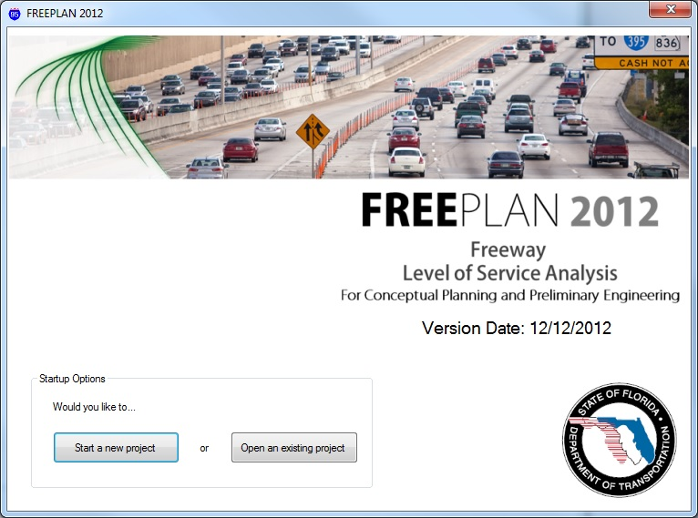
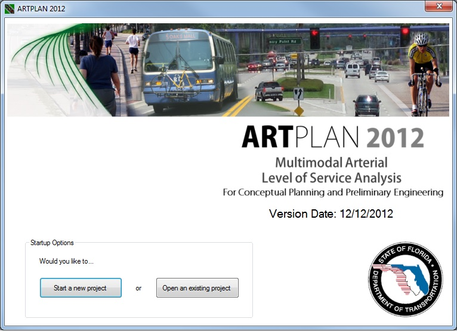
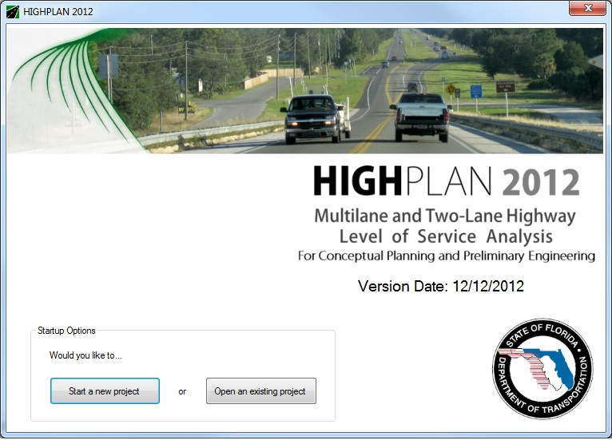

# LOSPLAN (Level Of Service PLANning)

LOSPLAN is a suite of three software programs that perform level of service analyses targeted for planning and preliminary engineering applications.&nbsp; The three programs are ARTPLAN, for signalized arterial facilities, FREEPLAN, for freeway facilities, and HIGHPLAN, for two-lane and multilane highway facilities. The LOSPLAN calculations are based largely on the analysis methodologies of Highway Capacity Manual, but also incorporate numerous simplifying assumptions and enhancements based on Florida Department of Transportation research.

<a href="References.md">Applicable Research Reports</a>

### LOSPLAN 2012

* <a href="http://www.dot.state.fl.us/planning/systems/programs/sm/los/los_sw2M2.shtm">FDOT download site</a>
* <a href="Computations2012/Computations2012.md">Computations Documentation</a>

### LOSPLAN 2009

* <a href="Computations2009/Computations2009.md">Computations Documentation</a>

